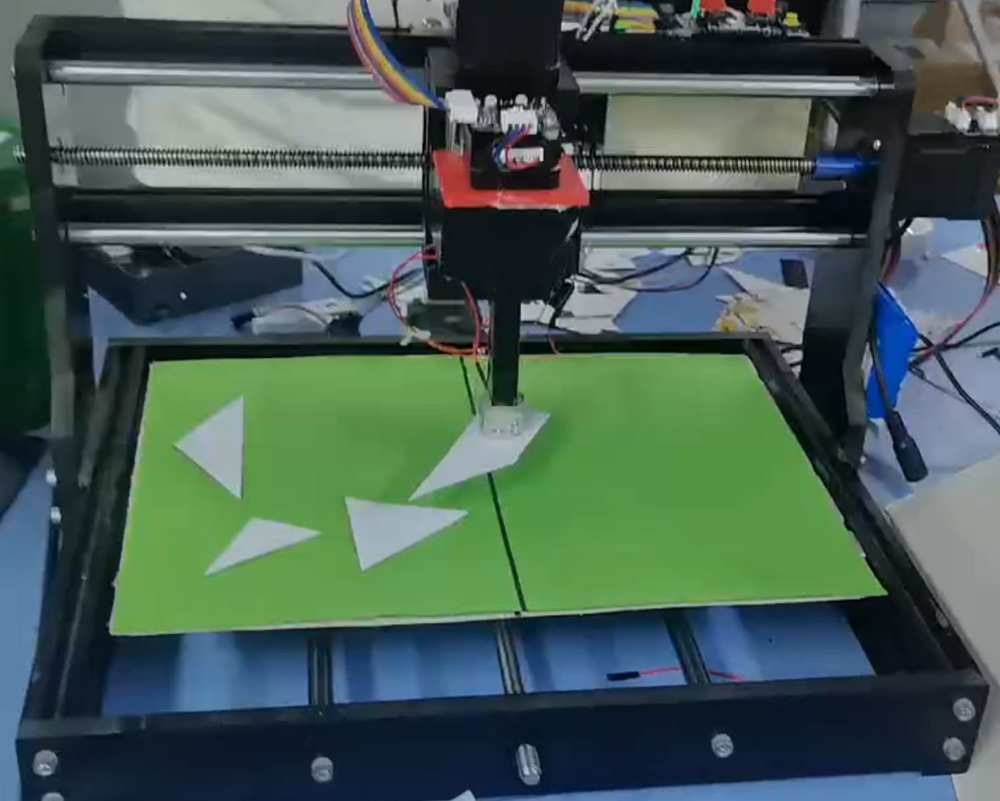

# 2026-河北省电子设计竞赛-E题（控制部分）

河北省电子设计竞赛 E 题（控制部分）作品的下位机控制固件。STM32F103C8T6
通过串口接收上位机下发的目标坐标，驱动四轴运动平台完成小铁片的
抓取—旋转—放置（pick-and-place）动作。

**比赛成绩：省一等奖**



## 系统概述

- **角色**：运动控制下位机，与上位机一问一答
- **执行机构**：X/Y/Z 平移轴 + Yaw 旋转轴，末端为电磁铁吸盘
- **工作流程**：按键选择模式 → 发送 READY → 接收坐标指令 → 执行动作 →
  回报 DONE，循环直至 3s 内无新指令
- **收尾动作**：四轴归零，LED 与蜂鸣器以 0.5Hz 闪烁提示 5s

```text
上位机 ──AA 01 坐标帧──▶ 下位机 ──FD 定位帧──▶ 4x 步进电机
       ◀──AA 02 DONE───          ◀──到位应答──
```

## 硬件配置

| 项目 | 配置 |
| --- | --- |
| 主控 | STM32F103C8T6（Cortex-M3 @ 72MHz，64KB Flash / 20KB SRAM） |
| 运动执行 | 4x 张大头闭环步进电机（步距角 1.8°，32 细分，4mm 导程） |
| 末端执行器 | 电磁铁，PB1 高电平吸合 |
| 上位机通信 | USART1，115200-8N1，中断逐字节接收 |
| 电机总线 | USART3，115200-8N1，四轴共享总线，按地址 1~4 寻址 |
| 人机指示 | PC13 板载 LED + PA3 有源蜂鸣器 |
| 模式输入 | PB4 / PB5 / PB6 三个按键（对应工作模式 1/2/3） |
| 调试烧录 | SWD（PA13/PA14，JTAG 已禁用），DAP-Link |

## 通信协议

### 上位机协议（USART1）

帧格式为 `AA + CMD + payload + BB`：

| 命令码 | 帧名 | 方向 | 长度 | 说明 |
| --- | --- | --- | --- | --- |
| `0x00` | READY | 下位机 → 上位机 | 4B | `AA 00 <mode> BB`，上报当前工作模式 |
| `0x01` | 坐标指令 | 上位机 → 下位机 | 17B | 抓取点 + 放置点 + 旋转角 |
| `0x02` | DONE | 下位机 → 上位机 | 3B | `AA 02 BB`，动作完成确认 |

坐标帧 (0x01) 布局：

```text
偏移: 0    1    2    3-4      5    6-7      8    9-10     11   12-13    14-15   16
      AA   01   'X'  X_grab   'Y'  Y_grab   'X'  X_place  'Y'  Y_place  Yaw     BB
```

- 全部坐标值为 **int16 大端**，实际值 = 原始值 / 100.0f
- `'X'`、`'Y'` 为 ASCII 字面量分隔符，各占 1 字节
- 抓取点与放置点均需 X、Y 双坐标，Yaw 为放置时的旋转角

### 电机总线协议（USART3）

采用张大头闭环步进电机自定义协议，帧格式 `addr + func + data + 0x6B`，
多字节参数大端序。绝对定位指令（func `0xFD`，13 字节）：

```text
addr FD dir speed_H speed_L accel pulse[4B BE] mode sync 6B
 1   2   3      4       5      6      7-10      11   12  13
```

- `pulse` 为目标绝对脉冲数（大端 uint32），`mode = 01` 绝对定位
- 电机到位后回发 `{addr} FD 9F 6B`，收到该应答才判定移动完成
- 上电初始化顺序：逐轴 `F3` 使能 → `0A` 清零回零 → 之后才可发 `FD`

脉冲换算（全程 float 计算，仅在组帧时转整型）：

```text
每圈脉冲 = 360° / 1.8° × 32 细分 = 6400 ppr
X/Y/Z 轴：pulse = 距离(mm) × 6400 / 4   = 距离 × 1600
Yaw 轴：  pulse = 角度(°) × 6400 / 360
```

## 关键实现

1. **两阶段等待重发**：发送运动指令后 0~3s 静默等待到位应答；3~7s 内每
   0.5s 对未到位轴重发同位置指令——已到位电机收到同位置指令会立即回发
   应答，借此确认「应答丢失但实际已到位」的情况。多轴重发错开 20ms，
   避免应答在共享总线上碰撞。
2. **位置追踪**：固件记录各轴当前目标位置，已在目标位的轴自动跳过通信；
   配合闭环电机编码器自锁，保证绝对定位精度。
3. **坐标偏移映射**：机器上电零点与上位机坐标系原点存在固定偏移，
   X/Y 轴目标 = 上位机坐标 + `HOME_OFFSET_*` 宏（按机械装配实测标定）。
4. **逐字节状态机解析**：UART1 中断逐字节喂入 `IDLE → WAIT_CMD →
   WAIT_DATA` 状态机，校验帧头帧尾，防止半帧与粘包干扰。
5. **多轴并行运动**：发送与等待分离（`Motor_SendMoveTo` +
   `Motor_WaitAllDone`），X/Y 轴同时启动、应答乱序到达按地址匹配。

## 目录结构

```text
diansai/
├── Core/           CubeMX 生成的 HAL 初始化代码（仅 USER CODE 区修改）
├── user/           业务代码
│   ├── motor.c/h       电机驱动：组帧、两阶段重发等待、位置追踪
│   └── protocol.c/h    上位机协议逐字节状态机
├── Drivers/        ST HAL 库与 CMSIS
├── MDK-ARM/        Keil MDK 工程（diansai.uvprojx）
└── diansai.ioc     STM32CubeMX 工程配置
```

## 构建与烧录

本项目使用 Keil MDK 构建（无 Makefile / CMake）：

1. 用 Keil MDK-ARM 打开 `MDK-ARM/diansai.uvprojx`
2. F7 编译，F8 通过 DAP-Link 下载调试
3. 或使用 DAP-Link 工具烧录编译输出 `MDK-ARM/diansai/diansai.hex`

> 在 `user/` 下新增源文件时，需手动加入 Keil 工程树，并在
> C/C++ → Include Paths 中添加 `../user/` 路径。

## 资源占用

| 项目 | 占用 | 上限 |
| --- | --- | --- |
| Flash（Code + RO + RW Data） | 15.5 KB | 64 KB |
| RAM（RW + ZI Data） | 1.8 KB | 20 KB |

## 许可

本项目代码以 [MIT License](LICENSE) 开源。`Drivers/` 目录下的
STM32 HAL 库与 CMSIS 代码版权归 STMicroelectronics 所有，
遵循其随附的开源许可。
